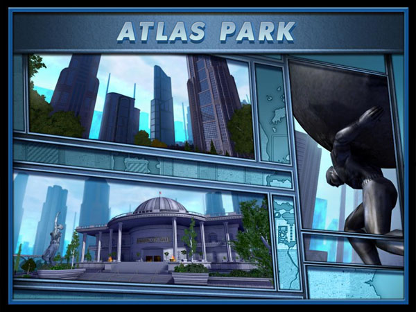

# Atlas Launcher

Portable MMO downloader/launcher using manifests.

Current Status: `getmanifest.py` is works as a command-line downloader/launcher
(essentially the same as
[Penguin On The Rocks](https://github.com/warpshotcoh/penguinrocks)) for
Linux! Now I just need to get a GUI going on it, then I can start working on
the more complex bits (like threading, partial downloads, caching MD5 tags,
and finding the best download target).

---

**NOTE:** The Homecoming folks recently put
[a new launcher](https://forums.homecomingservers.com/topic/23091-homecoming-launcher-public-beta/)
into beta. It's doing all the things Atlas was going to do, except for the
"runs native on Linux and MacOS" part... works well under WINE though. So I
might be abandoning this project.

---

Atlas uses an XML-based manifest to download the files associated with an MMO:

* Downloads any files you don't already have.
* Checks existing files against provided digests; downloads any changed or
  corrupted files.
* Launches based one one of the included profiles.

The goals of Atlas are:

* Portable (Linux, MacOS, Windows, possibly others).
* Threaded design to lessen the impact of slow downloads.
* Able to recover from partial downloads.
* Smart about not reading/hashing files that haven't changed since the last
  check.

Current state (2020-09-21):

* `proto/getmanifest.py` grabs the manifest, checks/downloads files, and
  launches the game; it uses caching to speed up subsequent launches... it's
  essentially "good enough" to be used thusly:

```
/path/to/getmanifest.py --dir /path/to/city-of-heroes http://url.for/manifest.xml
```

* Tested only with Linux and Homecoming, since that's the OS and server I play
  on.

* Working on "real" version's UI; it's slow going because I've never done GTK
  before.

## Open Questions

If you've got answers to these, or can point me in the right direction (yeah,
I know how to use [DuckDuckGo](https://duckduckgo.com/)) let me know!

* I can't figure out how to get GTK's WebKit2 on MacOS, let alone get its
  Python bindings there. Until then, Atlas will be less flashy than Tequila or
  Island Rum.
* Still not entirely sure how to package Atlas in a sane manner.

## Why "Atlas"

Atlas is named after Atlas Park, one of the starting zones in my favourite
MMO of all time, _City of Heroes_.



(Image courtesy of
[Paragon Wiki](https://archive.paragonwiki.com/wiki/Main_Page). It was
actually used in-game while loading the Atlas Park zone.)

## Requirements

The `getmanifest.py` prototype requires Python 3, but nothing extra.

The real launcher will also require GTK 3 and its introspection-based Python
module.

## Manifest Format

The manifest is an XML file with the following structure:

```xml
<?xml version="1.0" ?>
<manifest>
    <label>MMO Name</label>
    <profiles>
        <!-- Launch profiles; architecture defaults to x86 (32-bit). -->
        <launch exec="path/to/binary.exe" order="0" params="command line args"
            architecture="x64">Display Name</launch>
        ...
    </profiles>
    <filelist>
        <!-- MD5 is used only to detect file changes, not to ensure security. -->
        <file name="path/to/filename" size="num_bytes" md5="MD5 digest">
            <url>...</url>
            ...
        </file>
        ...
    </filelist>
    <launchers>
        <!-- Supported launchers, to check for new versions. -->
        <launcher id="name" size="num_bytes" md5="MD5 digest" version="version_string">
            <url>...</url>
            ...
        </launcher>
    </launchers>
    <forums>
        <!-- Display names/links to game forums. -->
        <forum name="Display Name" url="..." />
        ...
    </forums>
    <!-- URL to the game's main web page. -->
    <webpage>...</webpage>
    <!-- Web page to display inside the launcher during check/download. -->
    <poster_image url="..." />
</manifest>
```

This isn't the cleanest XML format, but it grew over time.

## License

This code is covered by the included [MIT license](LICENSE).
